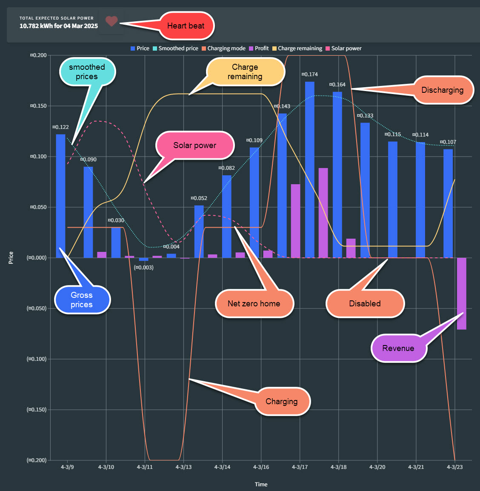

# SessyWeb - Docker Deployment Guide

SessyWeb is a web-based interface for managing **Sessy batteries** in a smart home environment. This guide provides precise step-by-step instructions on how to set up and run SessyWeb inside a Docker container.



---

## Prerequisites

Before proceeding, ensure that you have:

- **Docker installed and running**  
  If Docker is not installed, follow the instructions for your OS:
  - **Linux (Ubuntu/Debian)**: [Install Docker](https://docs.docker.com/engine/install/ubuntu/)
  - **Windows**: [Download Docker Desktop](https://docs.docker.com/desktop/install/windows-install/)
  - **Mac**: [Download Docker Desktop](https://docs.docker.com/desktop/install/mac-install/)

---

## Step 1: Clone the Repository

Clone the SessyWeb repository from GitHub:

```bash
git clone https://github.com/PaulSinnema/SessyWeb.git
cd SessyWeb
```

---

## Step 2: Configure `appsettings.json`

SessyWeb requires a properly configured `appsettings.json` file to function correctly. Below is the **anonymized** configuration file:

### **Full Example: `appsettings.json`**
```json
{
  "Logging": {
    "LogLevel": {
      "Default": "Warning",
      "Microsoft.AspNetCore": "Warning"
    }
  },
  
  "ConnectionStrings": {
    "SQLiteConnection": "Data Source=Sessy.db"
  },
  
  "AllowedHosts": "*",
  
  "Sessy:Batteries": {
    "Batteries": {
      "1": {
        "Name": "Battery 1",
        "BaseUrl": "http://<Battery1-IP>",
        "MaxCharge": 2200,
        "MaxDischarge": 1700,
        "Capacity": 5400
      },
      "2": {
        "Name": "Battery 2",
        "BaseUrl": "http://<Battery2-IP>",
        "MaxCharge": 2200,
        "MaxDischarge": 1700,
        "Capacity": 5400
      },
      "3": {
        "Name": "Battery 3",
        "BaseUrl": "http://<Battery3-IP>",
        "MaxCharge": 2200,
        "MaxDischarge": 1700,
        "Capacity": 5400
      }
    }
  },

  "Sessy:Meters": {
    "Endpoints": {
      "P1": {
        "Name": "P1",
        "BaseUrl": "http://<P1-Meter-IP>"
      }
    }
  },

  "PowerSystems": {
    "Endpoints": {
      "SolarEdge": {
        "Interface": "Modbus",
        "IpAddress": "<SolarEdge-Inverter-IP>",
        "Port": 1502,
        "SlaveId": 1,
        "Latitude": 52.0,
        "Longitude": 5.0,
        "TimezoneOffset": 1
      }
    }
  },
  
  "WeerOnline": {
    "BaseUrl": "https://weerlive.nl/api/weerlive_api_v2.php",
    "Location": "<Your-Location-Coordinates longitude and Latitude (nn.nnn,nn.nnn)>"
  },
  
"ManagementSettings": {
    // Charging hours when no ENTSO-E prices are available
    // Missing hours are treated as Stop all (dis)charging
    "ManualChargingHours": [ 0, 1, 2, 3, 4, 12, 13, 23 ],
    "ManualDischargingHours": [ 18, 19 ],
    "ManualNetZeroHomeHours": [ 5, 6, 7, 8 ,9, 10, 11, 14, 15, 16, 17, 20, 21 ],

    "Timezone": "Europe/Amsterdam", // Timezone where the application is running.
    "CycleCost": 0.09, // The minimum price difference in Euros justifying (dis)charging.
    "NetZeroHomeMinProfit": 0.00, // Minimum profit for Net Zero Home to be enabled in non (dis)charging hours
    "RequiredHomeEnergy": 16000, // The needs for the home in Watts (will have to estimate that in future release).
    "SolarCorrection": 2.1 // Double value for correcting the solar estimates
  }
}
```

---

## Step 3: Configure Docker Container on Synology DSM

### **General Settings**
- **Container Name**: `sessyweb`
- **Enable auto-restart**: ✅ Checked
- **Memory Limit**: `4096 MB`

### **Port Settings**
| Local Port | Container Port | Protocol |
|------------|---------------|----------|
| `8100`     | `443`         | TCP      |
| `8101`     | `80`          | TCP      |

### **Volume Settings**
| NAS Folder Location           | Container Mount Point  | Permissions |
|--------------------------------|------------------------|------------|
| `/SessyController/Config`      | `/SessyController/Config` | Read/Write |
| `/SessyController/data`        | `/data`               | Read/Write |

### **Environment Variables**
| Variable Name                | Value                                |
|------------------------------|--------------------------------------|
| `PATH`                        | `/usr/local/sbin:/usr/local/bin`    |
| `ASPNETCORE_HTTP_PORTS`       | `80`                                |
| `DOTNET_RUNNING_IN_CONTAINER` | `true`                              |
| `DOTNET_VERSION`              | `6.0.36`                            |
| `ASPNETCORE_URLS`             | `http://+:80`                      |
| `CONFIG_PATH`                 | `/SessyController/Config`           |

---

## Step 4: Running the Container

### **Deployment Steps on Synology NAS**
1. **Open DSM → Docker → Container Manager**.
2. **Create a new container** and choose the SessyWeb image.
3. **Set up General Settings** (Container name, auto-restart, memory limit).
4. **Configure Ports** (Map DSM ports to container ports).
5. **Set up Volume Mounts** (Bind NAS folders to the container).
6. **Define Environment Variables**.
7. **Start the container**.

### **Accessing SessyWeb**
- **HTTP**: `http://NAS-IP:8101`
- **HTTPS**: `https://NAS-IP:8100`

---

## Troubleshooting

- **Check logs**: `docker logs sessyweb`
- **Ensure NAS firewall allows ports 8100/8101**

---

By following these steps, you will have **SessyWeb** running inside a **Docker container** on **Synology NAS**, with persistent storage and proper port mapping. 🚀

